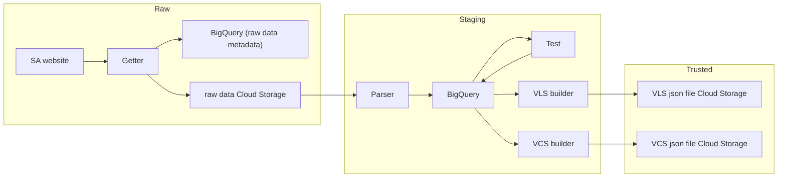

# Existing Security Bulletin Crawler Architecture (Current Refactor Effort prior to Rob's 10 week TDIS project)

## Global Workflow
* ([Draw.io diagram](https://eclypsium.atlassian.net/wiki/spaces/DA/pages/1363247109/Security+Advisories+collectors+Refactor?force_transition=093620dd-d73c-4bff-a536-88e0cf884334#Global-scheme-in-a-Mermaid-diagram-(markdown-compatible)))
* Mermaid Diagram


## Legacy Situation

Below security crawlers already exist. Documentation is in [Security Bulletins Advisories Collectors Specifications](https://eclypsium.atlassian.net/wiki/x/KwDcO)

### Case 1: Automated in VCS
* Cisco

### Case 2: Storing data in MongoDB KDB + creating rules for BIOS
* Dell
* Lenovo
* HP
* HPE (KO)
* Panasonic

### Case 3: Storing data in KDB without creating rules
* VMware

### Case 4: Storing data in Big Query without creating rules
* Intel
* AMD

## General Design of New Security Bulletin Crawlers

### Code Storage

#### POC
* Git project [advisory_hoarder](https://gitlab.com/fproj/poke/advisory-hoarder)
* First version for Juniper: branch [security-bulletins-llm](https://gitlab.com/fproj/data-team/catalog/catalog-crawlers/automation/-/tree/int/security-bulletins-llm?ref_type=heads) of git project [automation](https://gitlab.com/fproj/data-team/catalog/catalog-crawlers/automation)

#### New Crawlers
Stored in [security-bulletins-collectors](https://gitlab.com/fproj/data-team/security-bulletins-collectors):

* [security-bulletins-utils](https://gitlab.com/fproj/data-team/security-bulletins-collectors/security-bulletins-utils): library to share common functions
* [security-bulletins-apple](https://gitlab.com/fproj/data-team/security-bulletins-collectors/security-bulletins-apple)
* [security-bulletins-arista](https://gitlab.com/fproj/data-team/security-bulletins-collectors/security-bulletins-arista)
* [security-bulletins-cisco](https://gitlab.com/fproj/data-team/security-bulletins-collectors/security-bulletins-cisco)
* [security-bulletins-citrix](https://gitlab.com/fproj/data-team/security-bulletins-collectors/security-bulletins-citrix)
* [security-bulletins-dell](https://gitlab.com/fproj/data-team/security-bulletins-collectors/security-bulletins-dell) (refactor)
* [security-bulletins-f5](https://gitlab.com/fproj/data-team/security-bulletins-collectors/security-bulletins-f5)
* [security-bulletins-fortinet](https://gitlab.com/fproj/data-team/security-bulletins-collectors/security-bulletins-fortinet)
* [security-bulletins-hp](https://gitlab.com/fproj/data-team/security-bulletins-collectors/security-bulletins-hp) (refactor)
* [security-bulletins-hpe](https://gitlab.com/fproj/data-team/security-bulletins-collectors/security-bulletins-hpe) (refactor)
* [security-bulletins-intel-release-notes](https://gitlab.com/fproj/data-team/security-bulletins-collectors/security-bulletins-intel-release-notes)
* [intel-outdated-microcode](https://gitlab.com/fproj/data-team/security-bulletins-collectors/intel-outdated-microcode)
* [security-bulletins-juniper](https://gitlab.com/fproj/data-team/security-bulletins-collectors/security-bulletins-juniper)
* [security-bulletins-lenovo](https://gitlab.com/fproj/data-team/security-bulletins-collectors/security-bulletins-lenovo) (refactor)
* [security-bulletins-palo-alto](https://gitlab.com/fproj/data-team/security-bulletins-collectors/security-bulletins-palo-alto)
* [security-bulletins-supermicro](https://gitlab.com/fproj/data-team/security-bulletins-collectors/security-bulletins-supermicro)
* [security-bulletins-vmware](https://gitlab.com/fproj/data-team/security-bulletins-collectors/security-bulletins-vmware) (refactor)

#### Other Libraries
* [security_identifier_parser](https://gitlab.com/fproj/data-team/experiments/security-identifiers-parser): returns, based on an input string, a list of:
  * Common Vulnerabilities and Exposures (CVEs)
  * Advisories (LENOVO, HP, HPE, DELL, VMWARE, AMD, INTEL, PSR, CISCO)
  * Weaknesses (CWE)
* [custom-mongo-package](https://gitlab.com/fproj/data-team/experiments/custom-mongo-package): manages interactions with MongoDB database KDB

## Data Storage / Processes

Data is stored in GCP projects:
* ecl-dw-dev for dev
* dataproject-x for prod

### Raw Data / Getter

Raw data is generated by the getter process.

The output is stored in:

* GCS bucket `security-bulletins-advisories-raw`: all HTML or JSON files about security bulletins are stored in a folder named `Vendor_name > timestamp`. A new folder is created for each execution.
* Big Query dataset `raw` contains metadata in tables:
  * `raw.advisory_processing_history`: execution history

```
ADVISORY_PROCESSING_HISTORY_SCHEMA = [
   SchemaField('run_id', 'STRING', mode='REQUIRED'),             # run id
   SchemaField('processing_vendor', 'STRING', mode='REQUIRED'),  # Vendor name
   SchemaField('processing_type', 'STRING', mode='REQUIRED'),    # process executed (getter)
   SchemaField('processing_folder', 'STRING', mode='REQUIRED'),  # Bucket location, used to identify processed dataset
   SchemaField('processing_status', 'STRING', mode='REQUIRED'),  # Process execution status
   SchemaField('processing_timestamp', 'STRING', mode='REQUIRED'), # Process execution timestamp
   SchemaField('pages_crawled', 'INTEGER', mode='REQUIRED'),    # Number of pages parsed by the process
]
```

* `raw.advisory_getter`: GCS files metadata

```
ADVISORY_GETTER_SCHEMA = [
   SchemaField('run_id', 'STRING', mode='REQUIRED'),             # run id
   SchemaField('advisory_vendor', 'STRING', mode='REQUIRED'),    # Vendor name
   SchemaField('advisory_code', 'STRING', mode='NULLABLE'),      # Advisory code in case it can be set
   SchemaField('advisory_url', 'STRING', mode='NULLABLE'),       # crawled url
   SchemaField('advisory_url_raw', 'STRING', mode='REQUIRED'),   # raw url
   SchemaField('target_folder', 'STRING', mode='REQUIRED'),      # Bucket location, used to identify processed dataset
   SchemaField('raw_file_downloaded', 'BOOLEAN', mode='REQUIRED'), # True once file is downloaded
   SchemaField('raw_file_parsed', 'BOOLEAN', mode='REQUIRED'),  # True once file is parsed
   SchemaField('rules_generated', 'BOOLEAN', mode='REQUIRED'),  # Not updated (always set to false)
   SchemaField('raw_file_gcs_project_id', 'STRING', mode='NULLABLE'), # GC Project ID
   SchemaField('raw_file_gcs_bucket', 'STRING', mode='NULLABLE'), # Bucket name
   SchemaField('raw_file_located_at', 'STRING', mode='REQUIRED'), # File location path in the bucket
   SchemaField('raw_file_file_sha1', 'STRING', mode='NULLABLE'),  # Not used (always set to null). Could be used to know if html page was modified
   SchemaField('error', 'STRING', mode='NULLABLE'),         # In case a file could not be downloaded
   SchemaField('download_request', 'RECORD', mode='NULLABLE',  # request data used
       fields=[
           SchemaField('method', 'STRING', mode='NULLABLE'),
           SchemaField('body', 'STRING', mode='NULLABLE'),
           SchemaField('content_type', 'STRING', mode='NULLABLE'),
           SchemaField('referer', 'STRING', mode='NULLABLE'),
           SchemaField('authorization', 'STRING', mode='NULLABLE'),
           SchemaField('download_timestamp', 'TIMESTAMP', mode='NULLABLE'),
           SchemaField('status_code', 'INTEGER', mode='NULLABLE'),
       ],
   ),
   SchemaField('response_headers', 'JSON', mode='NULLABLE'),
]
```

### Staging Data / Parser & LLM

Staging data is produced by the parsing process.

The output is stored in separate BigQuery tables, one for each vendor, named `staging.advisory_parser_<vendor_name>` within the staging dataset.

#### Common Fields
```
ADVISORY_PARSER_SCHEMA = [
 ('adv_vendor', 'STRING', mode='REQUIRED'),         # Vendor name
 ('target_folder', 'STRING', mode='REQUIRED'),      # Bucket location, used to identify processed dataset
 ('parser_version', 'STRING', mode='REQUIRED'),     # commit hash of parser when executed
 ('adv_url', 'STRING', mode='NULLABLE'),            # advisory url
 ('adv_code', 'STRING', mode='NULLABLE'),           # advisory code 
 ('adv_title_raw', 'STRING', mode='NULLABLE'),      # advisory title parsed without transformation
 ('adv_title_llm', 'STRING', mode='NULLABLE'),      # advisory title improved with LLM if required
 ('adv_title', 'STRING', mode='NULLABLE'),          # advisory title cleaned
 ('adv_overview_raw', 'STRING', mode='NULLABLE'),   # advisory overview parsed without transformation
 ('adv_overview_llm', 'STRING', mode='NULLABLE'),   # advisory overview improved with LLM if required
 ('adv_overview', 'STRING', mode='NULLABLE'),       # advisory overview cleaned
 ('adv_description_raw', 'STRING', mode='NULLABLE'), # advisory description parsed without transformation
 ('adv_description_llm', 'STRING', mode='NULLABLE'), # advisory description improved with LLM if required
 ('adv_description', 'STRING', mode='NULLABLE'),     # advisory description cleaned
 ('adv_recommendation_id', 'STRING', mode='NULLABLE'),  # Eclypsium recommendation id (for VLS)
 ('adv_recommendation_raw', 'STRING', mode='NULLABLE'), # advisory recommendation parsed without transformation
 ('adv_recommendation_llm', 'STRING', mode='NULLABLE'), # advisory recommendation improved with LLM if required
 ('adv_recommendation', 'STRING', mode='NULLABLE'),     # advisory recommendation cleaned
 ('adv_component', 'STRING', mode='NULLABLE'),          # Eclypsium component (for VLS) 
 ('adv_date_published', 'TIMESTAMP', mode='NULLABLE'),  # advisory published date
 ('adv_date_updated', 'TIMESTAMP', mode='NULLABLE'),    # advisory last modified date
 ('adv_references', 'STRING', mode='REPEATED'),         # advisories url references
 ('adv_cves', 'STRING', mode='REPEATED'),               # cves present in the advisory
 ('adv_advisories', 'STRING', mode='REPEATED'),         # advisories present in the advisory
 ('adv_weaknesses', 'STRING', mode='REPEATED'),         # weaknesses present in the advisory (CWE)
 ('adv_products_affected', 'STRING', mode='REPEATED'),  # affected products by the advisory
 ('adv_products_affected_raw', 'STRING', mode='NULLABLE'), # affected products chapter parsed without transformation
 ('adv_products_affected_llm', 'STRING', mode='REPEATED'), # affected products chapter improved with LLM if required
 ('parser_status', 'STRING', mode='NULLABLE'),     # parsed / failed / skipped
 ('parser_error', 'STRING', mode='NULLABLE'),      # parse error if any
 ('is_llm_parsed', 'BOOL', mode='REQUIRED'),       # flag updated when version is parsed with LLM
 ('llm_error', 'STRING', mode='NULLABLE'),         # llm error if any
 ('adv_overall_score', 'FLOAT64', mode='NULLABLE'), # overall score collected from advisory
]
```

#### adv_versions
As ways to inform fix and affected versions are changing depending on the vendor, a specific record `adv_versions` is defined for each vendor (extend data in [security_bulletins_utils/parser/settings.py](https://gitlab.com/fproj/data-team/security-bulletins-collectors/security-bulletins-utils/-/blob/main/security_bulletins_utils/parser/settings.py)).

For instance:
```python
AdvisoryParserSettings.SCHEMA.extend(
   [
       SchemaField(
           'adv_versions', 'RECORD', mode='REPEATED',
           fields=[
               SchemaField('product_type', 'STRING', mode='NULLABLE'),
               SchemaField('version_affected', 'STRING', mode='NULLABLE'),
               SchemaField('version_fix', 'STRING', mode='NULLABLE'),
           ],
       ),
   ]
)
```

#### Specific Fields
Other fields may be added depending on the vendor (extend data in [security_bulletins_utils/parser/settings.py](https://gitlab.com/fproj/data-team/security-bulletins-collectors/security-bulletins-utils/-/blob/main/security_bulletins_utils/parser/settings.py))

For instance:
* Arista: adv_mitigation_raw and adv_platforms_affected_raw
* Fortinet: adv_impact
* HPE: adv_revision_id and adv_impact
* Palo Alto: adv_mitigation_raw and adv_configuration_raw
* VMWare: adv_revision_id and adv_notification_id

This table contains the necessary data for VLS:
* Advisory code
* Title
* Overview
* Description
* CVEs
* References
* Component (should be from [components-info](https://gitlab.com/fproj/backend/-/blob/master/enums/components-info.json))
* Recommendation (should be from [recommendation-mapping.json](https://gitlab.com/fproj/product/vulnerability-lookup-service/-/blob/master/src/enums/recommendation-mapping.json?ref_type=heads))

This table contains the necessary data for VCS (depending on the vendor):
* Advisory code
* Comment
* adv_versions

* advisory_override_<vendor_name>: This table, with almost the same fields as advisory_parser_<vendor_name>, is filled manually and can be used to override data wrongly collected by the parser.

### Trusted Data / VLS & VCS

The final data is produced by 2 processes:

#### vcs_builder:
* The output is a file with the rules in VCS format, stored:
  * in BigQuery
  * in GCS bucket `security-bulletins-advisories-vcs > Vendor_name > timestamp`

Note that this process:
* Only runs for SB for which variable AFFECTED_PRODUCT is in `advisory_parser_<vendor_name>.adv_products_affected`
* Runs using the latest PARSER_VERSION and TARGET_FOLDER by default, but these can be customized via environment variables with the same names.

#### vls_builder:
The output is a file with the advisories in VLS format, stored:
* in BigQuery
* in GCS bucket `security-bulletins-advisories-vls > Vendor_name > timestamp`

Depending on the vendor, this process can be run:
* For advisories for which at least a VCS rule was created
* For advisories that were not already manually created in VLS
* Using a specific filter

Note that:
* This process runs using the latest PARSER_VERSION and TARGET_FOLDER by default, but these can be customized via environment variables with the same names.
* Updated CVE attributes are collected from `dataproject-x.risk_score.CVECVSSKEVEPSS_V2`

## New Vendor Implementation

### Environment Variables

#### Mandatory
```
export GOOGLE_APPLICATION_CREDENTIALS="/path/to/your/service-account-file.json"
export GCP_PROJECT_ID="your-gcp-project-id"
```

#### Optional (with default values)
```
GCP_PROJECT_ID=dataproject-x
GCP_BUCKET_SB_RAW=security-bulletins-advisories-raw
GCP_BUCKET_SB_VLS=security-bulletins-advisories-vls
GCP_BUCKET_SB_VCS=security-bulletins-advisories-vcs
ADVISORY_GETTER_DATASET_ID=raw
ADVISORY_PARSER_DATASET_ID=staging
ADVISORY_VCS_DATASET_ID=dwh
```

In case MongoDB KDB is used (Vendors with integrity crawlers to collect product and UEFI data):
```
MONGO_CERT: path to the .pem file
MONGO_URI: uri to connect to the mongo database
```

### Functional Configuration

For each new vendor, a `settings.py` file is created containing its specific data:
* VENDOR_NAME: vendor name as we want it to appears in tables and files.
* AFFECTED_PRODUCT: used to filter advisories for which we know how to create VCS rules.
* EXISTING_VLS_TABLE: used to separate VLS advisories created manually from those created automatically (through the new SB crawlers)

This file is also used to collect environment variables and assign them default values.

Model:
```python
"""Implementation of the AdvisoryBuilder and PaloAltoAdvisoryAttributes for PaloAlto"""

import os
from typing import Final, Optional
from security_bulletins_utils.parser.settings import AdvisoryParserSettings

class PaloAltoSettings(AdvisoryParserSettings):
   VENDOR_NAME: Final[str] = 'PaloAlto'
   EXISTING_VLS_TABLE: Final[str] = 'vls_palo_alto_vulns'
   AFFECTED_PRODUCT: Final[str] = 'pan-os'
   PARSER_VERSION: Optional[str] = os.getenv('PARSER_VERSION')
   TARGET_FOLDER: Final[str] = os.getenv('TARGET_FOLDER')
   GCP_PROJECT_ID: Final[str] = os.getenv('GCP_PROJECT_ID', 'ecl-dw-dev')
   ADVISORY_GETTER_DATASET_ID: Final[str] = os.getenv('ADVISORY_GETTER_DATASET_ID', 'raw')
   ADVISORY_GETTER_TABLE_ID: Final[str] = os.getenv('ADVISORY_GETTER_TABLE_ID', 'advisory_getter')
   ADVISORY_PARSER_DATASET_ID: Final[str] = os.getenv('ADVISORY_PARSER_DATASET_ID', 'staging')
   ADVISORY_PARSER_TABLE_ID: Final[str] = 'advisory_parser_palo_alto'
   GCP_BUCKET_SB_RAW: Final[str] = os.getenv('GCP_BUCKET_SB_RAW', 'security-bulletins-advisories-raw-dev')
   GCP_BUCKET_SB_VLS: Final[str] = os.getenv('GCP_BUCKET_SB_VLS', 'security-bulletins-advisories-vls')
   GCP_BUCKET_SB_VCS: Final[str] = os.getenv('GCP_BUCKET_SB_VCS', 'security-bulletins-advisories-vcs-dev')
```

### Set a New Crawler Using the Getter Utils

The getter is the process of getting/scraping the data from the web pages, storing the .html files in GCS, and storing metadata in BigQuery.

When creating a new scraper/collector class, you should inherit from the `AdvisoryCollector` class and implement the `__collect_request_stats()` method. This method must return a `RequestStatsList` object that contains the metadata to scrap the web pages. `RequestStatsList` contains only one attribute (advisories) with a list of `RequestStats` objects. 

When developing the `__collect_request_stats()` method, at least one attribute of `RequestStats` must be provided: `url`. This will depend on the type of request that needs to be executed:
* For a GET request, the url is usually enough.
* For a POST request, you might need to also add the body, content_type, referer, and authorization to `RequestStats`.

Having a list of `RequestStats` with the correct attributes allows the getter to scrape the URLs, get the .html files, store them in the right place on GCS, and store metadata in the right BigQuery tables. The `AdvisoryCollector` parent class fills up the rest of the `RequestStats` attributes during the scraping process, like status_code, timestamp, stored_at, etc.

Please refer to `security_bulletins_utils.models.py` to check the structure of the `RequestStats` and `RequestStatsList` data classes.

After creating the new scraper class, you should run the scraper by calling the `run_crawler()` method. This method will scrape the web pages defined in the `RequestStatsList` object and store the data in GCS and BigQuery.

Summing up:
* Create a new class that inherits from `security_bulletins_utils.getter.base.AdvisoryCollector`
* Implement the `__collect_request_stats()` method
* Then call `run_crawler()` to start the crawling process

### Set a New Parser Using the Parser Utils

The parser extracts data from web pages and stores it in BigQuery.
Specific fields for table `staging.advisory_parser_<vendor_name>` and particularly `adv_versions` record should be added:
* parser/settings.py: inherit from `AdvisoryParserSettings`
* parser/models.py: inherit from `AdvisoryAttributes` and `AdvisoryVersion`

New parser classes should be created, that inherit from:
* The `AdvisoryBuilder` class and implement:
  * `get_attributes_class`: Returns the specific `AdvisoryAttributes` class to use, which depends on the vendor (e.g. `JuniperAdvisoryAttributes`, etc.)
  * `extend_advisory_attributes`: Extends the attributes of the advisory with additional vendor-specific attributes (for `AdvisoryAttributes` class interface)
* The `AdvisoryParser` class and implement:
  * property `vendor`: return the vendor name
  * property `parser_settings`: return the parser settings
  * property `getter_dataset`: BigQuery dataset ID for the getter (e.g., `raw`)
  * property `getter_table`: BigQuery table ID for the getter (e.g., `advisory_getter`)
  * `_extract_advisory_data`: Extract the HTML file into usable data
  * `_set_advisory_attributes`: Set the attributes of the advisory

After creating these new classes, you should run the parser by calling the `parse_htmls()` method. This method will parse all HTML files stored in GCS for this vendor using the files from the latest execution.

Summing up:
* Create a new class that inherits from `AdvisoryParserSettings`
* Create a new class that inherits from `AdvisoryAttributes`
* Create a new class that inherits from `AdvisoryVersion`
* Create a new class that inherits from `AdvisoryBuilder` and implement:
  * `get_attributes_class` method
  * `extend_advisory_attributes` method
* Create a new class that inherits from `AdvisoryParser` class and implement:
  * `vendor`, `parser_settings`, `getter_dataset`, `getter_table` properties
  * `_extract_advisory_data` method
  * `_set_advisory_attributes` method
* Then call `parse_htmls()` to start the parser process

### Set a New LLM Process Using the LLM Utils

LLM parser is executed by calling the `llm_parser.run_version()` function.
New LLM parser classes should be created, that inherit from:
* The `LlmParser` class and implement:
  * property `vendor`: return the vendor name
  * property `parser_settings`: return the parser settings
  * `run_version`: process is probably specific to the vendor but can use the functions from [security-bulletins-utils](https://gitlab.com/fproj/data-team/security-bulletins-collectors/security-bulletins-utils) to interact with LLM and BigQuery.

### Set a New VLS Generator Process Using the VLS Utils

The VLS generator is executed by calling the `vls.run_vls()` function without requiring additional development.

Data can be generated for advisories:
* For which at least a VCS rule was created (based on `vcs_table` attribute)
* That were not already manually created in VLS (based on `Settings.EXISTING_VLS_TABLE`)
* Returned using a specific filter (based on `parser_filter` attribute)

### Set a New VCS Generator Process

No shared functions were deployed in [security-bulletins-utils](https://gitlab.com/fproj/data-team/security-bulletins-collectors/security-bulletins-utils) yet.

Nevertheless, the convention is to:
* Consider only advisories for which variable AFFECTED_PRODUCT is in `advisory_parser_<vendor_name>.adv_products_affected`
* Verify the data before creating a rule
* Fill the below fields of the rule:
  * comment
  * check
  * fails
  * passes
  * output
* Store the result in GCS bucket `security-bulletins-advisories-vcs > Vendor_name > timestamp` using [security-bulletins-utils](https://gitlab.com/fproj/data-team/security-bulletins-collectors/security-bulletins-utils)
* Store the result in BigQuery table `staging.advisory_vcs_<vendor_name>` using [security-bulletins-utils](https://gitlab.com/fproj/data-team/security-bulletins-collectors/security-bulletins-utils)

## security-bulletins-utils

This library contains functions ready to be used for most steps of the process.

### GCS

Useful functions for GCS are available in the `GCSStorage` class (`security_bulletins_utils.storage.gcs`).
Main functionalities:
* Compress and decompress files.
* Get or put files in standardized named folders.

Since these functions are already invoked in the getter and parser functions from [security-bulletins-utils](https://gitlab.com/fproj/data-team/security-bulletins-collectors/security-bulletins-utils), they are generally not called directly from a new vendor library.

### Big Query

This Python module facilitates interaction with Google BigQuery to manage and process security advisories. It enables querying data, storing metadata, and marking advisories as processed.
Main functionalities:
* Store advisory metadata and processing history.
* Fetch unparsed advisory paths and mark them as parsed.
* Support for JSON and Pydantic models when handling advisory data.

Since these functions are already invoked in the getter and parser functions from [security-bulletins-utils](https://gitlab.com/fproj/data-team/security-bulletins-collectors/security-bulletins-utils), they are generally not called directly from a new vendor library.

### MongoDB

Useful functions for MongoDB are available in an external custom library: [custom-mongo-package](https://gitlab.com/fproj/data-team/experiments/custom-mongo-package).

KDB data only needs to be accessed for vendors for which integrity data is collected (model, packages, etc.). This data can be retrieved using the `get_model_packages` function, which fetches all the model-package relations from the MongoDB KDB for a given vendor and package type.

For these vendors, VCS rules are generated by specific DAGs that require `advisories_updatePackages` to be fed. This can be done using the `push_advisories_packages` function, which pushes the new relations between the advisory and the packages to the MongoDB KDB.

### Getter

The getter process was standardized and can be called through the `run_crawler()` function from class `AdvisoryCollector` in `security_bulletins_utils.getter.base.py`.

### Parser

The parser process was standardized and can be called through the `parse_htmls()` function from class `AdvisoryParser` in `security_bulletins_utils.parser.parser.py`.

### LLM

#### LlmModel Class

`LlmModel` class in `security_bulletins_utils.llm.llm.py` was implemented to facilitate queries to model `Meta-Llama-3.1-8B-Instruct-Q8_0.gguf` installed on a server located in Portland with below functions:
* `load_model`: Load the LLM model
* `unload_model`: Unload the LLM model
* `verify_models_loaded`: Verify that the LLM model is loaded. If not, it loads it
* `ask_for_versions`: Ask for the product versions that contain the vulnerability (3 retries)

#### LlmParser Class

`LlmParser` class in `security_bulletins_utils.llm.parser.py` can be called through `llm_parser.run_version(prompt=prompt, json_schema=json_schema)` and contains functions to:
* Parse advisories with a specific affected_product
* Prompt LLM
* Store the result in BigQuery

### VLS

The VLS process was standardized and can be called through the `run_vls()` function from class `VLS` in `security_bulletins_utils.vls.builder.py`.

## Annex

### Cisco

Automated process runs once a week in VCS.

#### Source
[CiscoPSIRT/openVulnQuery](https://github.com/CiscoPSIRT/openVulnQuery)

#### VLS
4,509 advisories

#### VCS Rules
* IOS: 508 rules
* FTD (Firewall Threat Defense): 179 rules
* NX-OS: 207 rules
* WLC (Wireless LAN Controller): 62 rules
* ASA (Adaptive Security Appliance): 225 rules

### Microsoft

#### Sources
This page was shared by Alex:
* [https://support.microsoft.com/en-us/topic/kb5012170-security-update-for-secure-boot-dbx-72ff5eed-25b4-47c7-be28-c42bd211bb15](https://support.microsoft.com/en-us/topic/kb5012170-security-update-for-secure-boot-dbx-72ff5eed-25b4-47c7-be28-c42bd211bb15)

I also found these pages:
* [https://msrc.microsoft.com/update-guide/vulnerability](https://msrc.microsoft.com/update-guide/vulnerability)
* [https://learn.microsoft.com/en-us/deployedge/microsoft-edge-relnotes-security](https://learn.microsoft.com/en-us/deployedge/microsoft-edge-relnotes-security)

Marcos shared these links:
* [KB5012170: Security update for Secure Boot DBX - Microsoft Support](https://support.microsoft.com/en-us/topic/kb5012170-security-update-for-secure-boot-dbx-72ff5eed-25b4-47c7-be28-c42bd211bb15)
* [UEFI Revocation List File | Unified Extensible Firmware Interface Forum](https://uefi.org/revocationlistfile)

#### Conclusion
There is a very large amount of advisories related to a lot of different Microsoft products.
Need to define which products and versions we are looking for.
=> Look for advisories linked to DBX

After talking with Marcos:
* It seems not possible to create VCS rules
* Requirement would be to download files for whitelisting based on links above: Need deeper research

### AMD

#### Source
[https://www.amd.com/en/resources/product-security.html](https://www.amd.com/en/resources/product-security.html)

### Aruba
* Not a priority but previously studied by Vlad.